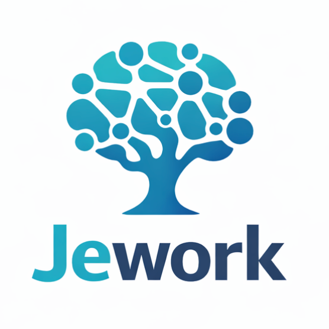

<p align="center">
  
</p>

# Jework

Jework 是一个面向团队的代码库协作服务。它可以连接项目代码库，让团队不同角色在同一套工作空间中获取代码与文档信息，并通过 Web 控制台和 MCP 接入完成协作。

你可以用 Jework 支持：

- 面向开发、产品、测试等角色的统一访问与权限管理
- 工作空间管理、代码检索与文档检索
- 对话式问答与知识库分析
- 给 Cursor / Claude Code / Codex 等客户端提供 MCP 服务

## 快速开始

### 方式一：Docker 运行（推荐）

```bash
docker run -d \
  --name jework \
  --restart always \
  -p 9508:9508 \
  -e PORT=9508 \
  -e DATA_DIR=/app/data \
  -v $(pwd)/data:/app/data \
  jeweis/jework:latest
```

启动后访问：`http://<服务器IP>:9508`

### 方式二：本地运行

```bash
cd jework
cp .env.example .env
pip install -r requirements
python main.py
```

本地访问：`http://127.0.0.1:9508`

## 首次使用流程

1. 打开页面，按引导创建超级管理员账号。
2. 创建工作空间并准备代码内容。
3. 按需创建普通用户并分配工作空间权限。
4. 进入“知识库 MCP”页面生成或重置 MCP Token。
5. 把 MCP 地址和 Token 配到你的 Agent 客户端。

## MCP 接入说明

### MCP 地址

- 通用入口：`/mcp`
- 工作空间入口：`/mcp/{workspace}`

推荐：
- 固定查一个工作空间：用 `/mcp/{workspace}`
- 需要跨多个工作空间：用 `/mcp`

### 鉴权 Header

```text
Jework-Authorization: <mcp_token>
```

### 客户端配置示例

```json
{
  "mcpServers": {
    "jework-workspace-a": {
      "type": "http",
      "url": "https://your-host/mcp/workspace-a",
      "headers": {
        "Jework-Authorization": "mcp_xxx"
      }
    }
  }
}
```

## 常用环境变量

- `PORT`：服务端口，默认 `9508`
- `DATA_DIR`：数据目录，默认 `./data`
- `FRONTEND_STATIC_DIR`：前端静态资源目录，默认 `./app/static`
- `APP_SECRET_KEY`：可选；多实例共享同一数据库时建议显式设置
- `CLAUDE_AGENT_MAX_TURNS`：单次请求最大循环轮次，默认 `20`
- `CLAUDE_AGENT_ALLOWED_TOOLS`：允许工具列表（逗号分隔）
- `ANTHROPIC_BASE_URL` / `ANTHROPIC_AUTH_TOKEN` / `ANTHROPIC_MODEL` 等：可选模型网关配置

## 数据与升级建议

- 请持久化 `DATA_DIR`（尤其是 `db` 与 `workspaces`）。
- 升级前建议先备份 `DATA_DIR`。
- 多环境部署时，建议每个环境使用独立的数据目录。

## 常见问题

1. 页面打不开
   - 检查端口映射是否为 `9508:9508`，并确认容器/进程已启动。
2. 登录后无工作空间
   - 检查当前用户是否已被授权访问对应工作空间。
3. MCP 调用返回 `401/403`
   - 检查 `Jework-Authorization` 是否配置正确，Token 是否为最新值。

## License

[MIT](./LICENSE)
